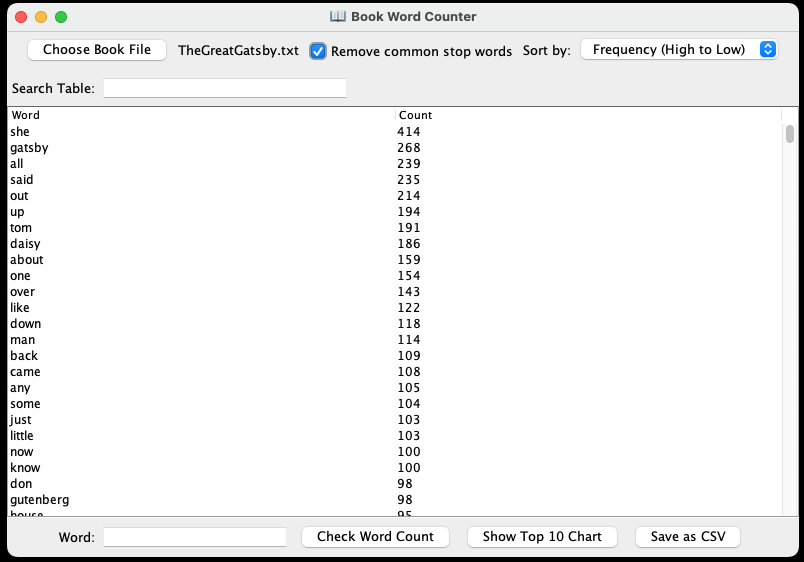
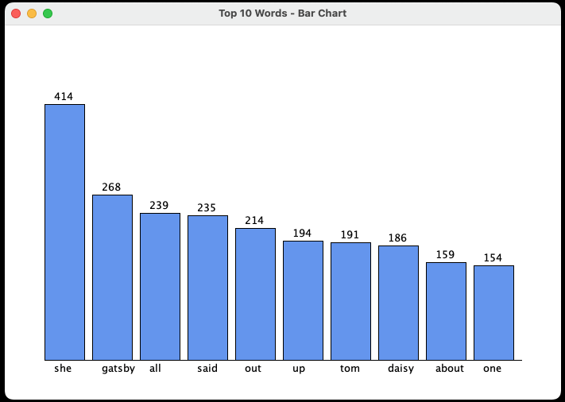

# 📖 Book Word Counter

A Java desktop application to analyze, visualize, and interact with the word frequencies of any text file. Users can load books, filter results, visualize data, and look up word definitions—all through a clean, interactive GUI.

> Built with Java Swing, JUnit 5, and JSON API integration. This project showcases strong fundamentals in file processing, GUI design, and test-driven development.

---

## 🚀 Features

- **📂 Load Any Book:** Analyze any `.txt` file.
- **🔍 Live Search Filter:** Instantly find words as you type.
- **🧹 Stop Word Removal:** Toggle to exclude common filler words like "the", "is", "and", etc.
- **🔢 Sort Options:** View results alphabetically or by frequency.
- **📘 Dictionary Lookup:** Double-click a word to fetch its definition via the [Free Dictionary API](https://dictionaryapi.dev/).
- **📊 Chart Visualization:** Display a bar chart of the top 10 most frequent words.
- **💾 CSV Export:** Save the word count results to a `.csv` file.
- **🧪 Unit Tests:** Includes comprehensive JUnit 5 tests for functionality and edge cases.

---

## 📁 Project Structure

```
 book-word-counter/
├── LICENSE
├── README.md
├── docs/                       # Software Design Document (SDD)
│   └── SDD.pdf
│   ├── screenshot-chart.png
│   └── screenshot-main.png
├── lib/                        # External libraries
│   ├── json-20240303.jar
│   └── junit-platform-console-standalone-1.10.2.jar
├── output/                     # Example output files
│   ├── WordCountResults-PrideAndPrejudice.txt
│   └── WordCountResults-TheGreatGatsby.txt
├── sample_inputs/             # Example .txt files for testing
│   ├── PrideAndPrejudice.txt
│   └── TheGreatGatsby.txt
├── src/                        # All source and test files
│   ├── BarChartWindow.java
│   ├── BookCounterGUI.java
│   ├── BookWordCounter.java
│   ├── BookWordCounterTest.java
│   ├── DictionaryLookupDialog.java
│   ├── Main.java
│   └── out/                   # Legacy compiled output (can be ignored)
├── run.sh                     # Script to compile and run

```

---

## 🧪 Running the Project

### 🔧 Prerequisites

- Java 17 or newer
- Bash-compatible terminal (for `run.sh`)
- Internet connection for dictionary API access

---

### ▶️ To Run the GUI App

```bash
./run.sh
```

---

### 🧪 To Run Unit Tests

```bash
java -jar lib/junit-platform-console-standalone-1.10.2.jar -cp src --scan-classpath
```

- This command will scan the src/ directory and run all JUnit 5 tests, including those in BookWordCounterTest.java. Make sure the .jar path matches your project structure

---

## 🖼 Screenshots

Here’s what the app looks like in action:

### 📚 Main Application Window




### 📊 Top 10 Word Chart



---

## 🧪 Running Tests

This project includes a full JUnit 5 test suite (`BookWordCounterTest.java`) covering:

- File and line-level word processing
- Edge cases (null input, punctuation, case sensitivity)
- CSV export functionality
- Large input performance

### ▶️ To Run Tests (Command Line)

```bash
javac -cp ".:lib/*" src/BookWordCounter.java src/BookWordCounterTest.java
java -jar lib/junit-platform-console-standalone-1.10.2.jar -cp . --scan-classpath
```

- You’ll see terminal output confirming test success or failure.
- ✅ All tests pass on clean builds.

---

## ⚙️ Technologies Used

- Java 17
- Java Swing (GUI)
- JUnit 5 (Testing)
- org.json (JSON parsing)
- Bash (run script)
- Free Dictionary API (definitions)

---

## 📌 Future Improvements

- Add support for non-English texts
- Display word cloud visualizations
- Integrate lemmatization (e.g. combining "run" and "running")
- Add dark mode or theme switcher

---

## 📄 License

This project is licensed under the terms of the [MIT License](LICENSE).

---

## 👨‍💻 About the Developer

**Zak Sheikh**  
Aspiring software engineer passionate about building tools that make life easier and more consistent—especially in the fitness and health tech space. I enjoy working across the stack, experimenting with UI design, and using data to power meaningful insights.

- 💼 [LinkedIn](https://www.linkedin.com/in/zaksheikh)  
- 📧 Email: zaksheikh45@gmail.com  
- 🧠 Portfolio: (https://github.com/Zak-Sheikh)
